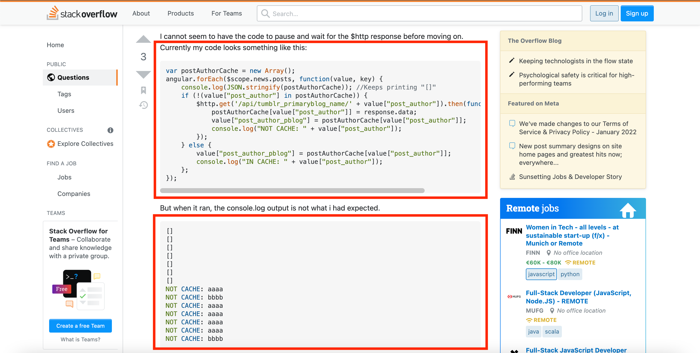

  

# We Stand On the Shoulders of Giants

This is a common metaphor used to advocate for utilizing the knowledge of those who came before us to achieve more progress. It would be wrong to not be aware of these teachings and experiences because whether we know it or not, people's past experiences are always influencing us. In programming, there are many opportunities to "stand on the shoulders of giants" because of design patterns and the efforts of former programmers.

# What Giants Are You Standing on?

The best part about these patterns is their reusability and accessibility. Christopher Alexander describes design patterns to be created:

> *...in such a way that you can use this solution a million times over, without doing it the same way twice* - Christopher Alexander

One of the very first design patterns we learned was introduced in the lesson about Classes and Objects. We learned how to create objects that could be manipulated to appropriately fit into our programs. We practiced making child objects from parent objects and figuring out how different functions can be inherited to progressively fit each class to build up our program. For most of us, this lesson was taught over two years ago. Yet the computational understanding and practice of it still remain.

For our final project, Job Match'UH, our group has utilized similar design patterns. We have to create many documents and collections to store and access data. Although they are their own separate documents, we planned for each collection to be built from each other so that they could be built off of each other. This means that their schemas may be similar, yet different enough to cater to their corresponding functionality on the application. With each of these collections, the application progresses further toward varying and improved functionality.

All the progress we've made so far with understanding and programming our application is because of the former programmers that documented and shared their code. Bowfolios, meteor-react-template, Digits, RadGrad, and other open sources of code are the reasons why we were able to implement the "special sauce" of our application.

# Alright, We're On a Giant. Now What?

We would learn very quickly the importance of templates, starter code, and design patterns if we were tasked to build our project from nothing. However, just like every programmer, design patterns are not perfect or forever. 

Using design patterns is really about embracing the learning opportunity that comes from studying and experimenting with them for our own needs. We should not copy-paste code simply because it makes things easier for us. We are given this opportunity to learn from other people's corrections and use that to direct our own choices. These resources, when used correctly, can really shape our experiences as programmers and people.
