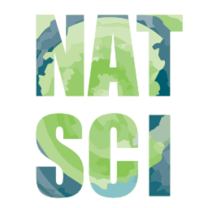

  

The Learning Emporium is an online (and hopefully in-person again!) drop-in tutoring service. All students in the College of Natural Sciences at the University of Hawai'i, Manoa are able to utilize the tutoring services, but students from any college are welcome to utilize the Learning Emporium. 
Tutoring services cover five subjects: General Chemistry, Organic Chemistry, Math, ICS, and Physics. The courses covered in each subject are as follows:  
  - CHEM 131, 161, 162, 161L, and 162L
  - CHEM 272, 272L, 273, and 273L
  - MATH 134, 140, 160, 215, 241, 242, 243, 251A, and 252A
  - ICS 111, 141, and 211
  - PHYS 100, 151, 152, 170, and 272

All of these are core subjects that most students of the College of Natural Sciences will eventually have to take.

I currently work as an office assistant for the Learning Emporium. My responsibilities include: coordinating orientations with tutors, creating tutorials for online tutoring, updating the Learning Emporium website, monitoring the Zoom rooms, helping troubleshoot problems tutors/students have with Zoom, and tracking information on how often the Learning Emporium is used. It is my job to help create and maintain a structure that has been implemented to handle online tutoring. When I am working, I make it a goal to improve the effectiveness of the Learning Emporium and make it as easy as possible for students to utilize it. 

A lot of our tasks at the Learning Emporium have changed since the beginning of COVID when everything was moved online. Similar to everyone else's experience, it was a train wreck. We were not prepared and had no idea how to begin again. Therefore, no quick decisions could be made and the Learning Emporium was closed for some time. During these times, I learned how important it was to collaborate ideas and consider how our changes would impact each group: tutors, students, and the Learning Emporium staff (that would be my team). My advisor took the time to survey each group and find out what they wanted to do moving forward. Through this experience, I learned to rely on others for help and that I produce better work when I recognize how my actions will impact others. I can no longer use the tutoring services because I've already passed those courses. But I hope my work has been beneficial to all the other students and tutors that rely on the Learning Emporium.

If you need tutoring, come to the <a href="https://uhnatsci.org/emporium/tutorschedules.php">Learning Emporium</a>!
