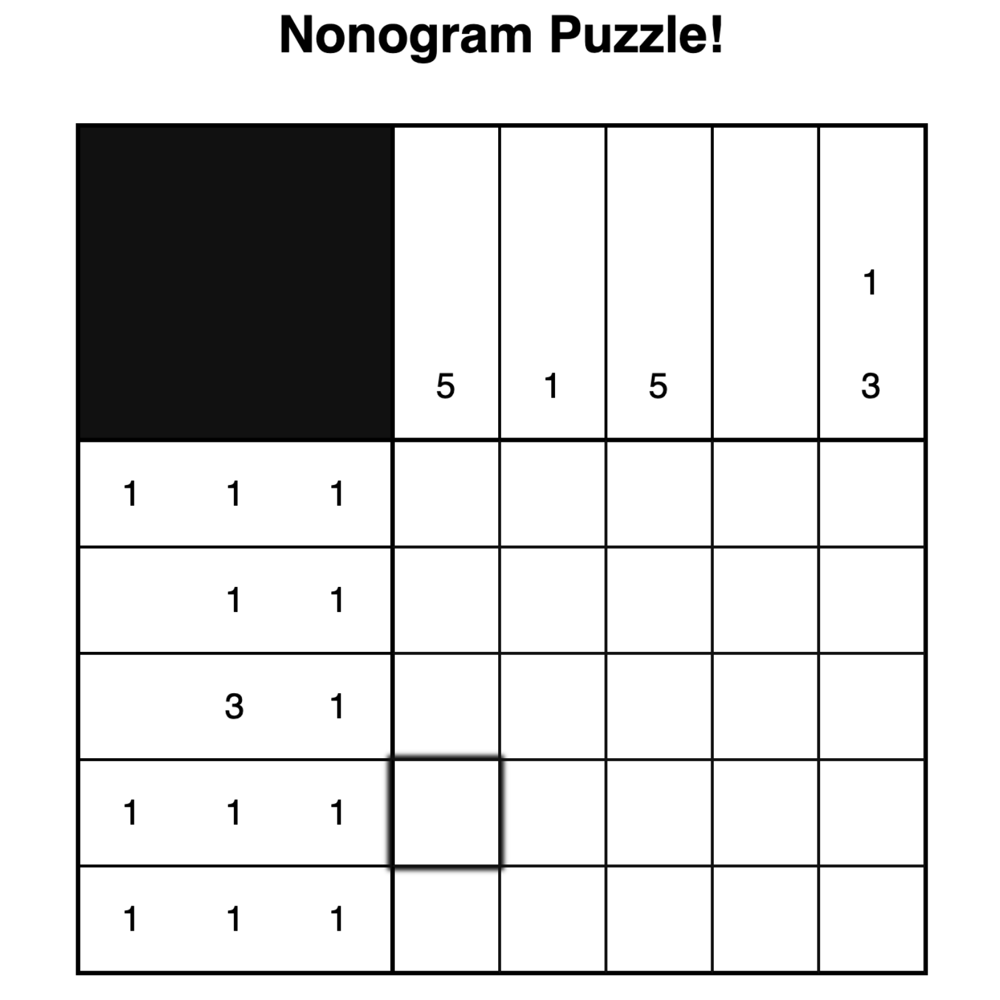

ICSpark is on RIO at the University of Hawai'i, Manoa. The goal of ICSpark is to provide coding programs to 6th - 12th graders. Mentors, which comprise of university students, will lead lessons on web development and are expected to contribute to the lessons by creating their own project. These projects are geared towared 6th -12th graders to complete as a final project. Focuses of each project vary, but the project I made focuses on Javascript.

I am a mentor for ICSpark and I made the Nonogram project to focus on practicing writing functions in Javascript. The Nonogram project was originally a challenge I was given when I first started programming. At that time, all of the files for the Nonogram challenge had to be written from start to finish and that was very difficult for a first time programmer, like myself, to figure out on my own. I rewrote the instructions for the Nonogram challenge to focus solely on Javascript and divided the project into parts that were easier to follow. I did this to show the student how to creating different functions is like solving the whole problem by parts.

The officers of ICSpark held a practice day for all mentors to present their projects. While listening to other mentors present, I took notes on how their project could improve because it could also be applied to my own. For example, many mentors included before and after videos that demonstrated the finished project. Making the challenge required thinking from the student's perspective and bringing myself back to when I first started programming. I had to be very detailed in my instructions but also not too wordy. I've never been the "teacher" before, so this was a very good experience to learn my own weaknesses in web development.
 
Source: <a href="https://github.com/michnotmeesh/icspark"><i class="large github icon"></i>Nonogram/vacay</a>
